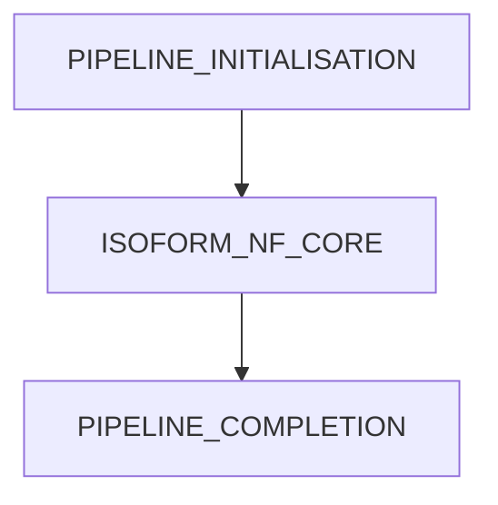
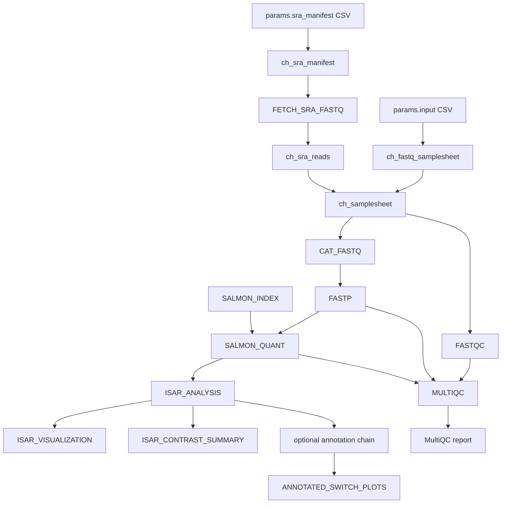
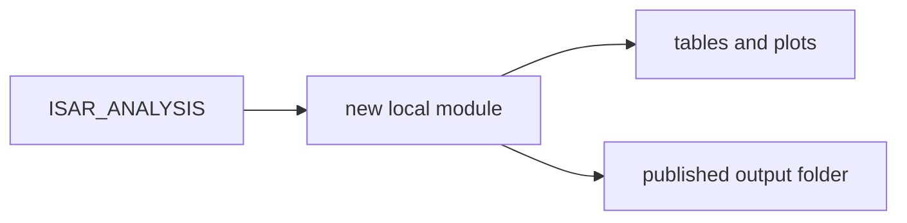

# Workflow Implementation Walkthrough

Last updated: 2026-07-05

This document walks through the implementation from the Nextflow entry point to the final outputs. It explains what each workflow component does, which files it consumes, which files it emits, and why it exists.

## Entry Point: `main.nf`

The file `main.nf` is the top-level entry point.

It imports:

```nextflow
include { ISOFORM } from './workflows/isoform'
include { PIPELINE_INITIALISATION } from './subworkflows/local/utils_nfcore_isoform_pipeline'
include { PIPELINE_COMPLETION } from './subworkflows/local/utils_nfcore_isoform_pipeline'
```

The top-level execution order is:



### `PIPELINE_INITIALISATION`

This subworkflow handles all startup tasks:

- prints version information if requested
- validates user parameters against `nextflow_schema.json`
- validates FASTQ samplesheets against `assets/schema_input.json`
- validates SRA manifests against `assets/schema_sra_manifest.json`
- validates contrasts against `assets/schema_contrasts.json`
- converts input rows into Nextflow channels
- emits the metadata CSV path for ISAR

### `ISOFORM_NF_CORE`

This is a small wrapper around the actual scientific workflow:

```nextflow
ISOFORM(samplesheet, sra_manifest, metadata_file)
```

It exposes these workflow channels:

- `quant_results`
- `isar_results`
- `isar_visualization_results`
- optional annotation results for Pfam, IUPred2A, SignalP, DeepTMHMM, and DeepLoc2
- `annotated_switch_plot_results`
- `multiqc_report`

### `PIPELINE_COMPLETION`

This handles end-of-run behavior:

- completion summary
- optional email
- optional webhook notification
- error message pointing to nf-core troubleshooting docs

## Main Workflow: `workflows/isoform.nf`

The scientific workflow is implemented in `workflows/isoform.nf`.

It imports these modules:

```nextflow
include { FASTQC } from '../modules/nf-core/fastqc/main'
include { CAT_FASTQ } from '../modules/nf-core/cat/fastq/main'
include { FASTP } from '../modules/nf-core/fastp/main'
include { SALMON_INDEX } from '../modules/nf-core/salmon/index/main'
include { SALMON_QUANT } from '../modules/nf-core/salmon/quant/main'
include { FETCH_SRA_FASTQ } from '../modules/local/fetch_sra_fastq/main'
include { ISAR_ANALYSIS } from '../modules/local/isar_analysis/main'
include { ISAR_VISUALIZATION } from '../modules/local/isar_visualization/main'
include { ISAR_CONTRAST_SUMMARY } from '../modules/local/isar_contrast_summary/main'
include { PFAM_PREPARE } from '../modules/local/pfam_prepare/main'
include { PFAM_SCAN } from '../modules/local/pfam_scan/main'
include { PFAM_IMPORT } from '../modules/local/pfam_import/main'
include { PFAM_VISUALIZATION } from '../modules/local/pfam_visualization/main'
include { IUPRED2A_PREPARE } from '../modules/local/iupred2a_prepare/main'
include { IUPRED2A_RUN } from '../modules/local/iupred2a_run/main'
include { IUPRED2A_IMPORT } from '../modules/local/iupred2a_import/main'
include { SIGNALP_PREPARE } from '../modules/local/signalp_prepare/main'
include { SIGNALP_RUN } from '../modules/local/signalp_run/main'
include { SIGNALP_IMPORT } from '../modules/local/signalp_import/main'
include { DEEPTMHMM_PREPARE } from '../modules/local/deeptmhmm_prepare/main'
include { DEEPTMHMM_RUN } from '../modules/local/deeptmhmm_run/main'
include { DEEPTMHMM_IMPORT } from '../modules/local/deeptmhmm_import/main'
include { DEEPLOC2_PREPARE } from '../modules/local/deeploc2_prepare/main'
include { DEEPLOC2_RUN } from '../modules/local/deeploc2_run/main'
include { DEEPLOC2_IMPORT } from '../modules/local/deeploc2_import/main'
include { ANNOTATED_SWITCH_PLOTS } from '../modules/local/annotated_switch_plots/main'
include { MULTIQC } from '../modules/nf-core/multiqc/main'
```

The key design idea is:

> Convert all inputs to FASTQ sample tuples as early as possible, run one shared quantification path, and then attach optional interpretation modules after IsoformSwitchAnalyzeR.

This means FASTQ mode and SRA mode do not need separate QC, trimming, Salmon, or ISAR workflows.

## Step 1: Optional SRA Download

Process:

```text
modules/local/fetch_sra_fastq/main.nf
```

Workflow call:

```nextflow
FETCH_SRA_FASTQ(ch_sra_manifest)
```

Input tuple:

```nextflow
[ meta, run_accession ]
```

Example:

```groovy
[
    [id: 'PATIENT32_NORMAL', condition: 'normal', replicate: 1, strandedness: 'auto', sra_run: 'SRR5275286'],
    'SRR5275286'
]
```

What the process does:

1. Downloads the SRA archive with `prefetch`.
2. Converts it to FASTQ with `fasterq-dump`.
3. Renames files to include the sample ID and accession.
4. Compresses FASTQ files with `pigz`.
5. Emits gzipped FASTQ files.

Important command parts:

```bash
prefetch SRR... --output-directory sra_cache --max-size ...
fasterq-dump --threads ... --skip-technical --split-files --outdir fastq ...
pigz --no-name --processes ... *.fastq
```

Output tuple:

```nextflow
[ meta, "*.fastq.gz" ]
```

After this process, SRA-derived reads look like normal FASTQ input.

## Step 2: Mix FASTQ and SRA Inputs

In `workflows/isoform.nf`:

```nextflow
ch_sra_reads = FETCH_SRA_FASTQ.out.reads.map { meta, reads ->
    def ordered_reads = (reads instanceof List ? reads : [reads]).sort { it.name }
    [ meta + [ single_end: ordered_reads.size() == 1 ], ordered_reads ]
}
ch_samplesheet = ch_fastq_samplesheet.mix(ch_sra_reads)
```

This converts SRA outputs into the same structure as FASTQ samplesheet rows.

Why sorting matters:

Paired-end tools expect read 1 and read 2 in the right order. Sorting by file name helps ensure `_1` comes before `_2`.

## Step 3: FastQC

Module:

```text
modules/nf-core/fastqc/main.nf
```

Workflow call:

```nextflow
FASTQC(ch_samplesheet)
```

Purpose:

FastQC checks raw sequencing read quality before trimming.

Non-biologist explanation:

FastQC asks questions like:

- Are the sequencing quality scores good?
- Do reads contain adapter sequences?
- Are there strange sequence patterns?
- Are some reads overrepresented?

Important outputs:

- `*_fastqc.html`
- `*_fastqc.zip`

The `.zip` files are passed to MultiQC:

```nextflow
ch_multiqc_files = ch_multiqc_files.mix(FASTQC.out.zip.collect{it[1]})
```

## Step 4: Concatenate Repeated Runs

Module:

```text
modules/nf-core/cat/fastq/main.nf
```

Workflow call:

```nextflow
CAT_FASTQ(ch_samplesheet)
```

Purpose:

If the same biological sample was sequenced in multiple runs or lanes, those rows have the same `sample` ID. The pipeline validates that their metadata match, then concatenates the FASTQ files.

Example:

```text
CONTROL_REP1 lane 1 + CONTROL_REP1 lane 2 -> CONTROL_REP1 merged reads
```

Why this matters:

Downstream tools should usually see one combined read set per biological sample, not separate lanes that would look like independent samples.

## Step 5: fastp

Module:

```text
modules/nf-core/fastp/main.nf
```

Workflow call:

```nextflow
FASTP(
    CAT_FASTQ.out.reads.map { meta, reads -> [ meta, reads, [] ] },
    false,
    false,
    false
)
```

Purpose:

fastp trims adapters and filters low-quality read sequence.

Non-biologist explanation:

Sequencing machines sometimes produce low-quality bases near read ends, and library preparation can leave adapter fragments in reads. fastp cleans those reads before Salmon estimates transcript abundance.

Inputs:

- merged raw FASTQ files
- sample metadata
- optional adapter FASTA, currently empty

Outputs:

- cleaned FASTQ files
- JSON report
- HTML report
- log file

The reports are passed to MultiQC:

```nextflow
ch_multiqc_files = ch_multiqc_files.mix(FASTP.out.json.collect{it[1]})
ch_multiqc_files = ch_multiqc_files.mix(FASTP.out.html.collect{it[1]})
ch_multiqc_files = ch_multiqc_files.mix(FASTP.out.log.collect{it[1]})
```

## Step 6: Salmon Index

Module:

```text
modules/nf-core/salmon/index/main.nf
```

Workflow call:

```nextflow
SALMON_INDEX(ch_genome_fasta, ch_transcript_fasta)
```

Purpose:

Builds an index of transcript sequences so Salmon can quantify reads efficiently.

Inputs:

- `--transcript_fasta`: required
- `--genome_fasta`: optional decoy sequence

If `--genome_fasta` is provided, the module builds a decoy-aware gentrome index:

1. Extract decoy sequence names from the genome FASTA.
2. Concatenate transcript FASTA and genome FASTA into `gentrome.fa`.
3. Build Salmon index with `-d decoys.txt`.

Why decoys matter:

Some reads may map ambiguously to transcripts and non-transcript genome regions. Decoys can reduce false transcript assignments.

Output:

```text
salmon/
```

This directory is the Salmon index.

## Step 7: Salmon Quantification

Module:

```text
modules/nf-core/salmon/quant/main.nf
```

Workflow call:

```nextflow
SALMON_QUANT(
    FASTP.out.reads,
    SALMON_INDEX.out.index,
    ch_gtf,
    ch_transcript_fasta,
    false,
    params.salmon_lib_type ?: ''
)
```

Purpose:

Estimate transcript abundance for each sample.

Non-biologist explanation:

RNA-seq reads are short fragments. Salmon estimates how many reads came from each known transcript. The output is not a direct count of molecules, but a statistical estimate of transcript abundance.

Important input:

- cleaned FASTQ files from fastp
- Salmon index
- GTF annotation
- library type / strandedness

Important output:

```text
quant.sf
```

`quant.sf` contains one row per transcript and columns such as:

- `Name`: transcript ID
- `Length`: transcript length
- `EffectiveLength`: length adjusted for fragment effects
- `TPM`: normalized abundance
- `NumReads`: estimated read count

The pipeline copies selected Salmon metadata files to help MultiQC parse them:

- `*_meta_info.json`
- `*_lib_format_counts.json`

### Salmon Library Type Logic

In `modules/nf-core/salmon/quant/main.nf`, the module chooses `--libType`.

If `--salmon_lib_type` is set and valid, it uses that directly.

Otherwise:

- samplesheet `auto` becomes Salmon `A` for automatic inference
- single-end unstranded defaults to `U`
- paired-end unstranded defaults to `IU`
- single-end forward stranded becomes `SF`
- paired-end forward stranded becomes `ISF`
- single-end reverse stranded becomes `SR`
- paired-end reverse stranded becomes `ISR`

## Step 8: IsoformSwitchAnalyzeR

Module:

```text
modules/local/isar_analysis/main.nf
```

Helper script:

```text
bin/run_isar_analysis.R
```

Workflow call:

```nextflow
ISAR_ANALYSIS(
    ch_analysis_script,
    ch_input_samplesheet,
    ch_contrasts,
    ch_quant_dirs,
    ch_gtf,
    ch_transcript_fasta
)
```

Purpose:

Import Salmon transcript quantifications into IsoformSwitchAnalyzeR and run differential isoform usage testing when possible.

### Nextflow Module Behavior

The module receives all Salmon quantification directories as a collected list:

```nextflow
ch_quant_dirs = SALMON_QUANT.out.results.map { meta, quant_dir -> quant_dir }.collect()
```

Inside the process, it creates symlinks:

```bash
mkdir -p salmon_quant
for quant_dir in ${quant_dirs}; do
    ln -s "$(readlink -f "$quant_dir")" "salmon_quant/$(basename "$quant_dir")"
done
```

Then it calls:

```bash
Rscript run_isar_analysis.R \
    --samplesheet ... \
    --quant-dir salmon_quant \
    --gtf ... \
    --transcript-fasta ... \
    --outdir isar_analysis \
    --dif-cutoff ... \
    --qvalue-cutoff ... \
    --top-n ...
```

### R Script Behavior

The R script performs these steps:

1. Parse command-line arguments.
2. Read the original samplesheet or SRA manifest.
3. Keep the unique `sample` to `condition` mapping.
4. Find matching Salmon `quant.sf` files.
5. Read `NumReads` and `TPM` values from each `quant.sf`.
6. Build count and abundance matrices.
7. Filter the GTF to only quantified transcripts.
8. Build comparison definitions from `--contrasts` or from two conditions.
9. Create a `switchAnalyzeRlist` with `importRdata()`.
10. Save `switchAnalyzeRlist_imported.rds`.
11. If statistical testing is possible, run `preFilter()` and `isoformSwitchTestDEXSeq()`.
12. Write switch summaries, top switches, notes, and R session info.

### Why GTF Filtering Exists

The R script writes:

```text
filtered_annotation.gtf
```

This keeps only transcript and gene rows relevant to quantified transcripts.

Why:

The tiny test reference and real references can differ in transcript coverage. Filtering helps ISAR import only transcripts that Salmon actually quantified.

### When the Statistical Test Runs

The R script builds comparisons in two ways:

- If `--contrasts` is supplied, each row defines one pairwise comparison with `case` and `control` conditions.
- If no contrast file is supplied and the dataset has exactly two conditions, the script creates one pairwise comparison automatically.

DEXSeq-based testing runs when:

- at least one comparison can be defined
- each condition used by those comparisons has at least two samples

This allows datasets with more than two conditions to run multiple pairwise contrasts in one workflow execution. If testing cannot be run, the script still imports the data and writes an analysis note explaining why testing was skipped.

### Important ISAR Outputs

Output folder:

```text
isar/isar_analysis/
```

Important files:

- `design_matrix.csv`: sample to condition table.
- `quant_dirs.csv`: sample to Salmon quantification directory.
- `filtered_annotation.gtf`: annotation subset used for import.
- `switchAnalyzeRlist_imported.rds`: ISAR object before testing.
- `switchAnalyzeRlist_analyzed.rds`: ISAR object after testing, when testing succeeds.
- `switch_summary.csv`: summary of switch test results.
- `top_switches.csv`: top switch candidates.
- `analysis_notes.txt`: human-readable notes.
- `sessionInfo.txt`: R package/session versions.

## Step 9: ISAR Visualization and Contrast Summary

These modules run after `ISAR_ANALYSIS` when enabled.

Modules:

```text
modules/local/isar_visualization/main.nf
modules/local/isar_contrast_summary/main.nf
```

Helper scripts:

```text
bin/run_isar_visualization.R
bin/run_isar_contrast_summary.R
```

`ISAR_VISUALIZATION` creates lightweight IsoformSwitchAnalyzeR plots and top-candidate tables from the analyzed ISAR object. It does not add external annotation.

`ISAR_CONTRAST_SUMMARY` summarizes significant isoform switches across comparisons. It writes a per-comparison count table and plot, plus an UpSet-style intersection plot for multi-contrast experiments.

Both modules are downstream consumers of `ISAR_ANALYSIS.out.results`. They are written to exit successfully with notes and empty tables when there are no significant switches to plot.

## Step 10: Optional Annotation Chain

The optional annotation modules all start from the ISAR result object and, when possible, create an updated annotated ISAR object.

The workflow tracks this with:

```nextflow
ch_current_annotated_isar = ISAR_ANALYSIS.out.results
```

Each successful import updates that channel:

```nextflow
ch_current_annotated_isar = PFAM_IMPORT.out.results
ch_current_annotated_isar = IUPRED2A_IMPORT.out.results
ch_current_annotated_isar = SIGNALP_IMPORT.out.results
ch_current_annotated_isar = DEEPTMHMM_IMPORT.out.results
ch_current_annotated_isar = DEEPLOC2_IMPORT.out.results
```

This means later annotation modules see the annotations imported by earlier modules, and annotated switch plots can use the newest available object.

### Pfam

Modules:

```text
modules/local/pfam_prepare/main.nf
modules/local/pfam_scan/main.nf
modules/local/pfam_import/main.nf
modules/local/pfam_visualization/main.nf
```

Pfam has three modes:

- `--pfam_db`: prepare amino-acid candidates, run `pfam_scan.pl`, and import the generated domain hits.
- `--pfam_results`: import an existing `pfam_scan.pl` result file.
- `--run_pfam_prepare`: prepare candidate FASTA files without necessarily running Pfam.

`PFAM_VISUALIZATION` is optional and creates domain-consequence summaries and domain architecture plots after Pfam import.

### IUPred2A, SignalP, DeepTMHMM, and DeepLoc2

These modules follow a similar pattern:

```text
PREPARE -> RUN -> IMPORT
```

The prepare step extracts amino-acid sequences from significant switch candidates. If `--annotated_switch_genes` is supplied, those genes are force-included in the candidate FASTA so requested gene-level plots can be annotated even when automatic top-candidate selection differs across runs.

The run step executes the external predictor or converts its output:

- IUPred2A predicts intrinsically disordered regions and ANCHOR2 binding regions.
- SignalP predicts signal peptides.
- DeepTMHMM predicts transmembrane topology regions.
- DeepLoc2 predicts subcellular localization labels.

The import step uses the relevant IsoformSwitchAnalyzeR import/analyze function and writes a new annotated ISAR object for the next downstream step.

## Step 11: Annotated Switch Plots

Module:

```text
modules/local/annotated_switch_plots/main.nf
```

Helper script:

```text
bin/run_annotated_switch_plots.R
```

This module renders gene-level `switchPlot()` outputs from the newest available annotated ISAR object.

Important parameters:

- `--run_annotated_switch_plots`: enables the module.
- `--annotated_switch_top_n`: number of automatically selected genes.
- `--annotated_switch_genes`: comma-separated list of genes to plot.
- `--annotated_switch_condition1` and `--annotated_switch_condition2`: optional comparison selection.
- `--annotated_switch_plot_topology`: controls whether topology is shown when available.

Available tracks depend on which upstream annotations were run and successfully imported.

## Step 12: Software Versions

The workflow collects tool versions from modules using nf-core conventions.

Examples:

- FastQC version
- fastp version
- Salmon version
- SRA tools version
- pigz version
- IsoformSwitchAnalyzeR version
- annotation tool versions where the modules emit them

These are collected and written to:

```text
pipeline_info/isoform_software_mqc_versions.yml
```

MultiQC then includes these in the final report.

## Step 13: MultiQC

Module:

```text
modules/nf-core/multiqc/main.nf
```

Purpose:

MultiQC combines reports and metadata from the whole run into one HTML report.

Inputs include:

- FastQC zip files
- fastp JSON / HTML / log files
- Salmon metadata JSON files
- workflow parameter summary
- method description
- software versions

Output:

```text
multiqc/multiqc_report.html
```

## Channel Summary

The main data channels can be summarized as:



## How Output Publishing Works

Publishing is configured in:

```text
conf/modules.config
```

Default behavior:

```nextflow
publishDir = [
    path: { "${params.outdir}/${task.process.tokenize(':')[-1].tokenize('_')[0].toLowerCase()}" },
    mode: params.publish_dir_mode,
    saveAs: { filename -> filename.equals('versions.yml') ? null : filename }
]
```

This means most process outputs are published to a folder based on the process name.

Example:

- `FASTQC` outputs to `fastqc/`
- `FASTP` outputs to `fastp/`
- `SALMON_QUANT` outputs to `salmon/`
- `ISAR_ANALYSIS` outputs to `isar/`

MultiQC has a custom publish directory:

```text
multiqc/
```

## Error Handling and Resume Behavior

Resource and retry behavior is configured in:

```text
conf/base.config
```

The default error strategy retries some transient failures and finishes otherwise:

```nextflow
errorStrategy = { task.exitStatus in ((130..145) + 104 + 175) ? 'retry' : 'finish' }
maxRetries = 1
```

If a run fails after some successful tasks, Nextflow can reuse completed tasks:

```bash
nextflow run . ... -resume
```

This is one of the biggest practical benefits of Nextflow.

## Adding a New Workflow Component

The current recommended pattern for adding a new component is:

1. Add or import a module under `modules/`.
2. Define its inputs and outputs using nf-core tuple conventions where possible.
3. Include the module in `workflows/isoform.nf`.
4. Connect it to existing channels.
5. Add user-facing parameters to `nextflow.config`.
6. Add parameter definitions to `nextflow_schema.json`.
7. Add output docs to `docs/output.md`.
8. Add usage docs to `docs/usage.md`.
9. Add or update nf-test coverage.

For example, a new downstream visualization should usually become a local module after `ISAR_ANALYSIS` or after the relevant annotation import:



The module should handle no-switch or missing-annotation cases gracefully, because real small subsets may import successfully but have no significant switches or no matching annotation rows.
