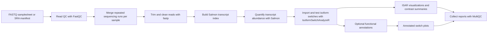

# Project Structure and nf-core Basics

Last updated: 2026-07-05

This document explains how the repository is organized and how the current project fits into the usual Nextflow / nf-core style. It is written for readers who are still learning Nextflow, nf-core, and the biological context of the pipeline.

## Big Picture

This repository is a reusable Nextflow pipeline for reference-based isoform switch analysis.

In plain terms, the pipeline answers this type of question:

> Given RNA sequencing data from two biological conditions, do the cells use different transcript variants of the same gene?

The current reusable path is:



The important limitation is that the current workflow is reference-based. It can analyze transcripts that are present in the supplied transcript FASTA and GTF annotation. It does not yet discover novel transcripts that are missing from the reference.

## What Nextflow Provides

Nextflow is a workflow engine. It lets us describe a pipeline as a set of independent processes that exchange files through channels.

The main concepts are:

- A `process` is one executable step, such as running FastQC or Salmon.
- A `workflow` connects processes together.
- A `channel` is a stream of values or files passed between workflow steps.
- A `params` value is a user-facing pipeline option, such as `--input`, `--gtf`, or `--outdir`.
- A `profile` is a configuration preset, such as `-profile docker` or `-profile test,docker`.
- A `work/` directory stores intermediate task executions, logs, and cached files.
- A published output directory stores final results for the user.

Nextflow is helpful because it handles parallelization, caching, retries, container execution, and resuming previous runs.

## What nf-core Adds

nf-core is a community standard for Nextflow pipelines. It adds conventions so pipelines are easier to reuse, review, publish, and maintain.

Important nf-core ideas used in this repo:

- The pipeline has a standard layout generated from the nf-core template.
- User parameters are described in `nextflow_schema.json`.
- Input CSV files have their own schemas in `assets/schema_*.json`.
- Reusable tool wrappers live in `modules/`.
- Larger workflow building blocks live in `subworkflows/`.
- Pipeline-wide configuration lives in `nextflow.config` and `conf/`.
- Documentation lives in `docs/`.
- Test data and nf-test definitions live in `tests/`.
- Containers or Conda environments are specified per module.
- MultiQC is used to collect QC and run metadata into one report.

The current repository is nf-core-style, but it is not yet fully ready for official nf-core publication. Publication metadata, generated metadata files, local module hardening, testing, and documentation should still be expanded before submission.

## Top-level Files

### `main.nf`

This is the pipeline entry point. When a user runs:

```bash
nextflow run Anton-Bch/isoform-nf-core ...
```

Nextflow starts here.

The file does three main things:

1. Runs pipeline initialization.
2. Calls the main `ISOFORM_NF_CORE` workflow.
3. Runs pipeline completion hooks such as summaries, emails, and notifications.

The actual scientific workflow is not implemented directly in `main.nf`. Instead, `main.nf` delegates to `workflows/isoform.nf`.

### `workflows/isoform.nf`

This is the main analysis workflow.

It wires together:

- optional SRA download
- FastQC
- FASTQ concatenation
- fastp
- Salmon index
- Salmon quantification
- IsoformSwitchAnalyzeR
- ISAR visualization and multi-contrast summaries
- optional Pfam, IUPred2A, SignalP, DeepTMHMM, and DeepLoc2 annotation
- optional annotated switch plots
- MultiQC

If you want to understand the end-to-end data flow, this is the most important file.

### `nextflow.config`

This file defines pipeline defaults and profiles.

Examples:

- `params.input = null`
- `params.run_isar = true`
- `params.isar_dif_cutoff = 0.1`
- `params.isar_qvalue_cutoff = 0.05`
- `profiles.docker`
- `profiles.test`

User-facing values from `params` can be overridden from the command line:

```bash
nextflow run . \
    --input samplesheet.csv \
    --outdir results \
    -profile docker
```

### `nextflow_schema.json`

This file documents and validates command-line parameters. nf-core uses it to generate help text and to check that users pass correct values.

For example, it defines:

- `--input`
- `--sra_manifest`
- `--contrasts`
- `--transcript_fasta`
- `--genome_fasta`
- `--gtf`
- `--salmon_lib_type`
- `--run_isar`
- `--isar_dif_cutoff`
- `--isar_qvalue_cutoff`
- `--isar_top_n`
- `--run_isar_visualization`
- `--run_isar_contrast_summary`
- `--run_pfam_prepare`
- `--run_iupred2a`
- `--run_signalp`
- `--signalp_container`
- `--run_deeptmhmm`
- `--run_deeploc2`
- `--deeploc2_container`
- `--run_annotated_switch_plots`

The schema is important because it is both documentation and validation. If a required reference file is missing, the pipeline can fail early with a helpful error instead of failing later inside Salmon or R.

### `modules.json`

This tracks nf-core modules installed in the pipeline. It helps nf-core tooling know where modules came from and how they can be updated.

## Important Folders

### `assets/`

This folder contains static files used by the pipeline.

Important files:

- `samplesheet.csv`: example FASTQ input.
- `sra_manifest.csv`: example SRA input.
- `contrasts.csv`: example contrast definition.
- `schema_input.json`: validation schema for `--input`.
- `schema_sra_manifest.json`: validation schema for `--sra_manifest`.
- `schema_contrasts.json`: validation schema for `--contrasts`.
- `multiqc_config.yml`: MultiQC configuration.
- `methods_description_template.yml`: text that can appear in MultiQC reports.
- email and notification templates from the nf-core template.

The schema files in `assets/` are especially important because they define the exact CSV interface accepted by the pipeline.

### `bin/`

This folder contains executable helper scripts.

Currently important:

- `run_isar_analysis.R`: imports Salmon results into IsoformSwitchAnalyzeR and runs the differential isoform usage test when the design has enough replicates.
- `run_isar_visualization.R`: creates lightweight ISAR candidate tables and plots.
- `run_isar_contrast_summary.R`: creates per-comparison counts and UpSet-style intersection plots.
- `run_pfam_*`, `run_iupred2a_*`, `run_signalp_*`, `run_deeptmhmm_*`, and `run_deeploc2_*`: prepare, import, and summarize optional functional annotations.
- `run_annotated_switch_plots.R`: renders gene-level switch plots with the newest available annotation layers.
- `nextflow-vm-monitor`: utility script for monitoring a VM during long runs.

In nf-core pipelines, scripts in `bin/` are automatically available on the task `PATH`, but this pipeline currently passes `run_isar_analysis.R` explicitly into the local ISAR module.

### `conf/`

This folder contains Nextflow configuration split into smaller files.

Important files:

- `base.config`: default CPU, memory, time, retry behavior, and process labels.
- `modules.config`: process-specific options and output publishing rules.
- `test.config`: parameters for the small built-in test run.
- `test_full.config`: placeholder for a larger test profile.
- `igenomes.config`: nf-core reference genome configuration mechanism.
- `igenomes_ignored.config`: used when iGenomes is disabled.

The most important beginner point is that code describes what should run, while config describes how it should run.

For example:

- `workflows/isoform.nf` says Salmon quantification should happen.
- `conf/base.config` says how many CPUs and how much memory a medium process gets.
- `conf/modules.config` says where results should be published.

### `docs/`

This folder contains user, developer, and planning documentation.

Important docs:

- `usage.md`: how to run the pipeline.
- `output.md`: what files the pipeline creates.
- `getting_started/`: beginner-friendly conceptual docs.
- `developer/`: implementation walkthroughs and code-oriented docs.
- `operations/`: runtime and infrastructure notes.

### `modules/`

This folder contains Nextflow process definitions.

There are two types:

- `modules/nf-core/`: imported or adapted nf-core modules for common tools.
- `modules/local/`: project-specific modules that are not standard nf-core modules.

Current nf-core modules:

- `fastqc`
- `cat/fastq`
- `fastp`
- `salmon/index`
- `salmon/quant`
- `multiqc`

Current local modules:

- `fetch_sra_fastq`
- `isar_analysis`
- `isar_visualization`
- `isar_contrast_summary`
- `pfam_prepare`, `pfam_scan`, `pfam_import`, `pfam_visualization`
- `iupred2a_prepare`, `iupred2a_run`, `iupred2a_import`
- `signalp_prepare`, `signalp_run`, `signalp_import`
- `deeptmhmm_prepare`, `deeptmhmm_run`, `deeptmhmm_import`
- `deeploc2_prepare`, `deeploc2_run`, `deeploc2_import`
- `annotated_switch_plots`

The distinction matters for maintainability. nf-core modules are reusable and can often be updated from nf-core/modules. Local modules are our responsibility.

### `subworkflows/`

This folder contains reusable workflow-level logic.

Important folders:

- `subworkflows/nf-core/`: standard nf-core helper subworkflows.
- `subworkflows/local/`: pipeline-specific helper subworkflows.

The custom local helper subworkflow is:

- `subworkflows/local/utils_nfcore_isoform_pipeline/main.nf`

It handles initialization, parameter validation, samplesheet parsing, SRA manifest parsing, contrast validation, and completion summaries.

### `tests/`

This folder contains test configuration and tiny test fixtures.

Important files:

- `tests/default.nf.test`: nf-test definition.
- `tests/fixtures/samplesheet.csv`: tiny FASTQ samplesheet.
- `tests/fixtures/contrasts.csv`: tiny contrast file.
- `tests/fixtures/reference/`: tiny transcript, genome, and GTF files.
- `tests/fixtures/reads/`: tiny gzipped FASTQ files.

The test data is intentionally tiny. It is not biologically meaningful. Its purpose is to prove that the workflow wiring works.

## How Files Move Through the Pipeline

At runtime, Nextflow does not pass files like a normal script. It passes channels.

For example, a simplified FASTQ sample becomes:

```nextflow
[ meta, reads ]
```

where `meta` is a map such as:

```groovy
[
    id: 'CONTROL_REP1',
    condition: 'control',
    replicate: 1,
    strandedness: 'auto',
    batch: 'batch1',
    single_end: false
]
```

and `reads` is one or two FASTQ files:

```groovy
[
    file('CONTROL_REP1_R1.fastq.gz'),
    file('CONTROL_REP1_R2.fastq.gz')
]
```

The same tuple pattern is used by many nf-core modules. This is one of the reasons the current pipeline can reuse nf-core modules cleanly.

## Process Labels and Resources

The `conf/base.config` file defines resource labels such as:

- `process_single`
- `process_low`
- `process_medium`
- `process_high`
- `process_long`
- `process_high_memory`

Modules attach labels to processes. For example, `ISAR_ANALYSIS` uses:

```nextflow
label 'process_medium'
```

This means the default resources come from the `process_medium` block in `conf/base.config`.

Users or institutions can override resources without editing the pipeline code. This is a core nf-core design principle.

## Containers and Conda

Each module declares a Conda environment and a container.

For example:

- Salmon modules use a Salmon BioContainer.
- FastQC uses a FastQC container.
- ISAR uses `quay.io/biocontainers/bioconductor-isoformswitchanalyzer:2.6.0--r44h3df3fcb_0`.

When running with `-profile docker`, Nextflow uses containers. This is preferred because it makes runs more reproducible than relying on locally installed tools.

When running with `-profile conda` or `-profile mamba`, Nextflow creates Conda environments instead.

## Published Outputs vs Work Directory

Nextflow creates two important locations:

- `work/`: internal task directories, logs, and cached files.
- `--outdir`: final published results.

The `work/` directory can become large, but it allows Nextflow to resume runs:

```bash
nextflow run . ... -resume
```

The `--outdir` folder is what users normally inspect and archive.

## Recommended Reading Order

If you are new to the repo, read these documents in this order:

1. [Project structure and nf-core basics](project_structure_and_nfcore_basics.md): repository layout, Nextflow concepts, and how the pipeline pieces fit together.
2. [Tools and biology explained](tools_and_biology_explained.md): genes, transcripts, isoforms, read types, references, and the tools in plain language.
3. [Interface and inputs explained](interface_and_inputs_explained.md): samplesheets, SRA manifests, contrasts, references, and validation rules.
4. [Prerequisites to run the pipeline](prerequisites.md): runtime setup, reference requirements, annotation resources, and compute expectations.
5. [Usage](../usage.md): concise command-line usage for routine runs.
6. [Output](../output.md): result folders, key files, and how to interpret outputs.
7. [Workflow implementation walkthrough](../developer/workflow_implementation_walkthrough.md): code-oriented explanation of the main workflow, modules, and helper scripts.
